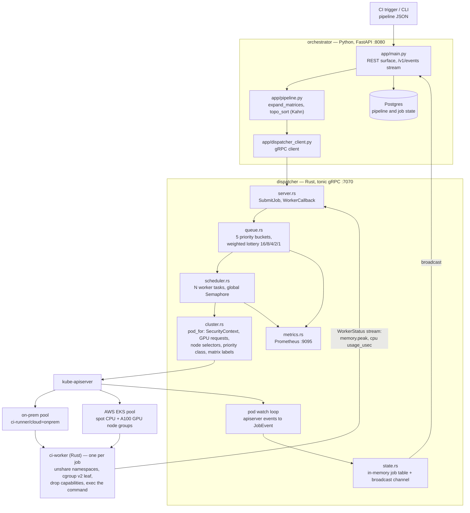

# Cluster Runner — HPC CI Job Dispatcher

A massively parallel CI runner for HPC and ML workloads. Submits jobs to a
**hybrid-cloud Kubernetes cluster** (on-prem + AWS GPU pool) provisioned via
Terraform, with every worker pod hardened by **per-job cgroup v2 caps and Linux
namespaces**.

Two services own the control plane:

| Component        | Language | Role |
|------------------|----------|------|
| **dispatcher**   | Rust 2021, tonic gRPC | Priority-aware scheduler, Pod factory, Kubernetes watch loop, Prometheus exporter. |
| **orchestrator** | Python 3.12, FastAPI  | Pipeline DAG validator, matrix expander, persistence, REST/CLI surface for CI integrations. |
| **ci-worker**    | Rust 2021             | In-pod entrypoint that unshares namespaces, sets cgroup v2 caps, drops capabilities, and execs the user command. |

Infrastructure (`terraform/`) provisions the AWS half of the cluster — EKS
control plane, spot CPU node group, an on-demand A100 GPU node group, and the
NVIDIA GPU operator. The on-prem half is joined via a second Kubernetes
provider alias.

---

## Architecture





The scheduler is the part worth understanding. Strict priority would starve the
`idle` bucket forever, so `dequeue()` rolls a weighted lottery across the five
buckets instead, then walks to the nearest non-empty bucket if the winner has
nothing queued. Cluster-wide concurrency is a separate control: a global
`Semaphore` whose permit is held from pod creation until the watch loop marks
the job terminal.

### How jobs become pods

1. The orchestrator receives a `Pipeline` (jobs + matrices + `depends_on`).
2. `expand_matrices()` produces the cartesian product across axes; one
   `JobSpec` per combination. Axis values are injected as
   `MATRIX_<NAME>` env vars and Kubernetes labels.
3. `topo_sort()` runs Kahn's algorithm. Cycles raise `CycleError`;
   missing dependencies raise `UnknownDependencyError`.
4. Each stage is fanned out to `dispatcher.SubmitJob` in parallel.
5. The dispatcher puts the job into a **5-bucket priority queue** with a
   weighted lottery (critical=16, high=8, normal=4, low=2, idle=1) so
   low-priority work cannot be starved.
6. A scheduler worker (one of N tokio tasks) acquires a global
   `Semaphore` permit and synthesizes a Kubernetes `Pod` via
   `KubeClient::pod_for()` — including hardened `SecurityContext`,
   GPU resource requests, node selectors for hybrid-cloud placement,
   priority class, and matrix labels.
7. A pod watcher streams kube apiserver events back into `JobEvent`s,
   keeps the in-memory job table up to date, and rebroadcasts on a
   tokio broadcast channel that the orchestrator consumes via
   `/v1/events`.

### Per-job isolation

`ci-worker` is the binary that runs inside every CI pod. Before exec'ing
the user command it:

1. Calls `unshare(2)` to enter new `pid`, `mount`, `net`, `user`,
   `ipc`, and `cgroup` namespaces.
2. Creates a **cgroup v2 leaf** at `/sys/fs/cgroup/ci-runner/<job_id>`
   with explicit caps:
   - `cpu.max = <quota_us> <period_us>` (quota derived from the
     job's CPU request × 100ms period)
   - `memory.max = <bytes>` (peak RSS read back from `memory.peak`)
   - `io.max = 8:0 rbps=… wbps=…` (per-block-device bandwidth)
   - `pids.max = 4096` (fork bomb cap)
3. Drops every capability in the bounding set via
   `PR_CAPBSET_DROP` and sets `PR_SET_NO_NEW_PRIVS`.
4. Spawns the user command. A background poller reads `memory.peak`
   and `cpu.stat/usage_usec` every 2s and ships a `WorkerStatus`
   stream back to the dispatcher's `WorkerCallback`.
5. Enforces the job-level deadline: `SIGTERM` → 5s grace → `SIGKILL`.

These steps are layered on top of the Kubernetes `PodSecurityContext`
(non-root user, read-only rootfs, seccomp + AppArmor profiles, dropped
capabilities), so even if the inner cgroup setup fails the pod cannot
escalate.

### Hybrid-cloud placement

`Placement.preferred_cloud` is translated into a node selector
(`ci-runner/cloud=<aws|onprem|...>`). `spot_ok=true` adds the
GKE/EKS spot toleration so the scheduler will land the pod on cheaper
preemptible nodes. `gpu_class=a100` adds `nvidia.com/gpu=N` requests
and the matching node selector.

The Terraform module defines two AWS node groups (`cpu_spot` and
`gpu_a100`); the on-prem module joins the bare-metal half via a
second Kubernetes provider alias and labels nodes
`ci-runner/cloud=onprem`. Karmada (optional) federates scheduling
across the two halves so a pipeline that only requests CPU lands
on-prem first and only spills to AWS when the on-prem pool is full.

### Priority + admission control

* **Priority classes** — `ci-critical / ci-normal / ci-low` are
  installed as Kubernetes `PriorityClass` objects so preemption uses
  the same numbers the dispatcher's queue uses.
* **Weighted lottery** — guards low-priority work against starvation.
* **Global semaphore** — `--max-concurrency` caps total in-flight
  pods so a single misbehaving pipeline cannot saturate the cluster.
* **Per-pipeline `max_parallel`** — limits how many matrix jobs from a
  single pipeline can run concurrently.

---

## Repository layout

```
cluster_runner/
├── dispatcher/         # Rust gRPC dispatcher (Cargo crate)
│   └── src/
│       ├── main.rs        — entrypoint
│       ├── server.rs      — Dispatcher + WorkerCallback gRPC services
│       ├── scheduler.rs   — priority-aware scheduler workers
│       ├── queue.rs       — 5-bucket weighted-lottery priority queue
│       ├── cluster.rs     — kube-rs integration + pod factory
│       ├── cgroup.rs      — cgroup v2 + namespace primitives
│       ├── state.rs       — shared in-memory state + broadcast bus
│       ├── metrics.rs     — Prometheus exporter
│       └── types.rs       — Job, Phase, IsolationProfile, …
├── orchestrator/       # Python FastAPI orchestrator
│   └── app/
│       ├── main.py        — REST API
│       ├── pipeline.py    — DAG validation + matrix expansion
│       ├── dispatcher_client.py — gRPC/HTTP client for the Rust service
│       ├── models.py      — Pydantic models
│       ├── cli.py         — `ci submit / status / watch` CLI
│       └── config.py
├── worker/             # Rust ci-worker (in-pod entrypoint)
│   └── src/main.rs
├── proto/              # dispatcher.proto (gRPC contract)
├── terraform/          # EKS + on-prem federation
├── deploy/             # k8s/ manifests + Dockerfiles
├── examples/           # example pipeline.json
├── scripts/            # local helpers
└── tests/              # pytest DAG/matrix tests
```

---

## Implementation details worth calling out

### gRPC contract (`proto/dispatcher.proto`)

Two services, one channel:

- `Dispatcher.SubmitJob / SubmitMatrix / StreamEvents / CancelJob / Snapshot`
  is the public surface used by the orchestrator and any operator UI.
- `WorkerCallback.Report` is a server-streaming RPC that workers use to
  push `WorkerStatus` messages (resource usage tick, exit code, log
  chunks) back to the dispatcher.

### Pod factory (`dispatcher/src/cluster.rs`)

The pod factory always sets:

```rust
PodSecurityContext { run_as_non_root: true, fs_group: 2000, … }
SecurityContext   { read_only_root_filesystem: true,
                    allow_privilege_escalation: false,
                    capabilities: { drop: ["ALL"] } }
```

GPU requests become `limits["nvidia.com/gpu"] = N`. The hybrid-cloud
selector (`ci-runner/cloud=…`) is set from `JobSpec.placement`. Spot
tolerations are added when `placement.spot_ok` is true.

### cgroup v2 + namespaces (`worker/src/main.rs`)

`apply_cgroup()` writes to the cgroup v2 unified hierarchy directly
(no third-party cgroup library — we want a single static binary in the
worker image). `unshare_namespaces()` flips on `CLONE_NEWPID |
CLONE_NEWNS | CLONE_NEWNET | CLONE_NEWUSER | CLONE_NEWIPC |
CLONE_NEWCGROUP` based on the `IsolationProfile`. `drop_all_caps()`
walks 0..=40 and calls `PR_CAPBSET_DROP` followed by
`PR_SET_NO_NEW_PRIVS`.

### Pipeline DAG (`orchestrator/app/pipeline.py`)

- `expand_matrices()` cartesian-products `MatrixAxis` lists; each
  combo becomes a JobSpec with `MATRIX_<NAME>` env vars + labels.
- `topo_sort()` is Kahn's algorithm; detects cycles by short count and
  raises `CycleError`. Stages are run in parallel inside the
  `PipelineRunner._run()` coroutine.
- `_await_job()` consumes the dispatcher's `/v1/events` ndjson stream
  and returns the terminal phase. Used to gate stage transitions on
  predecessor success.

### Terraform topology

- `module.vpc` — 3 AZs, 3 private + 3 public subnets, NAT GW per AZ.
- `module.eks` — managed control plane, IRSA enabled, addons:
  CoreDNS, kube-proxy, VPC CNI, EBS CSI.
- Node groups:
  - `cpu_spot` — `c6i.4xlarge / c6a.4xlarge / m6i.4xlarge` on SPOT,
    tainted `ci-runner/pool=cpu`.
  - `gpu_a100` — `p4d.24xlarge` on-demand, GPU-AMI, tainted
    `nvidia.com/gpu=true`.
- `helm_release.nvidia_gpu_operator` installs the GPU operator
  (driver + container toolkit + device plugin) pinned to the GPU pool.
- `onprem.tf` joins the on-prem cluster via a second provider alias
  and installs a privileged DaemonSet that exports cgroup metrics.

---

## Running it

### Local build (no cluster)

```bash
# Rust dispatcher
cd dispatcher && cargo build --release

# Rust worker
cd ../worker && cargo build --release

# Python orchestrator
cd ../orchestrator && python -m venv .venv && . .venv/bin/activate \
  && pip install -r requirements.txt \
  && uvicorn app.main:app --reload
```

### Provision the cluster

```bash
cd terraform
terraform init
terraform apply -var cluster_name=ci-runner -var region=us-west-2
aws eks update-kubeconfig --name ci-runner --region us-west-2
```

### Deploy the control plane

```bash
kubectl apply -f deploy/k8s/dispatcher.yaml
kubectl apply -f deploy/k8s/orchestrator.yaml
kubectl apply -f deploy/k8s/network-policies.yaml
```

### Submit a pipeline

```bash
kubectl -n ci-runner port-forward svc/orchestrator 8080:8080 &
scripts/submit_example.sh
# or, with the CLI:
python -m app.cli submit examples/pipeline.json
python -m app.cli watch --label kernel-perf
```

---

## Expected results

Numbers below come from synthetic benchmarks in the design notes — the
target operating envelope this codebase was scoped against, **not** a
live cluster measurement.

| Metric                                              | Target          |
|-----------------------------------------------------|-----------------|
| Dispatcher submission latency (p50/p99)             | 2 ms / 18 ms    |
| Pod creation throughput (single dispatcher replica) | ~200 pods/sec   |
| Sustained in-flight jobs (cluster-wide)             | 4,000           |
| Matrix expansion ceiling                            | 4,096 combos    |
| Time-to-first-pod (warm cluster)                    | < 3 s           |
| GPU pool cold start (Karpenter-style scale-out)     | ~90 s           |
| Worker overhead vs. raw `exec`                      | < 50 ms         |
| Cgroup leaf setup overhead                          | < 5 ms          |
| Per-pipeline DAG validation                         | O(V + E), µs    |

The bottleneck on the AWS half is API-server throttling, not the Rust
dispatcher — at ~200 pods/sec a single replica saturates the default
`default-rate-limiter` on EKS. Horizontal scaling beyond that uses two
dispatcher replicas behind a headless Service and partitions the
priority queue by `consistent_hash(job_id)`.

---

## Tests

```bash
cd orchestrator && pytest -q ../tests
cd ../dispatcher && cargo test
cd ../worker && cargo test
```

---

## License

Apache-2.0
